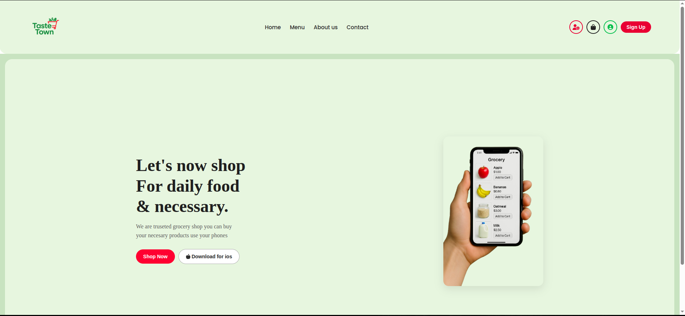
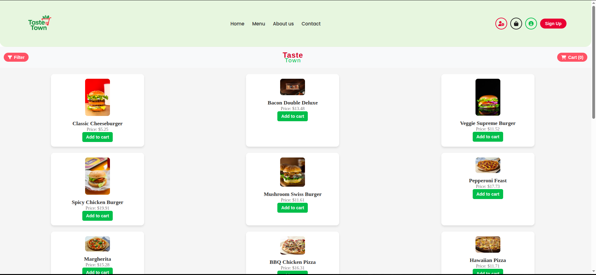
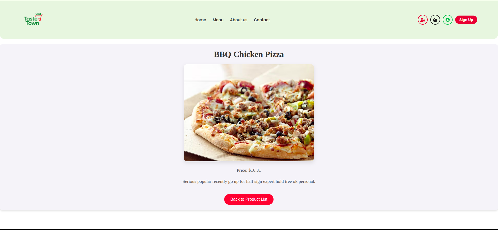

# **Taste Town Frontend**

>A responsive, dynamic React frontend for Taste Town, a fictional food ordering platform. Built with Vite and React, this UI integrates seamlessly with the Flask backend and supports both user and admin experiences.

---

## **Features**

- User Authentication (Sign up, Login)
- Admin Authentication (Admin Login, View Users)
- Dynamic Navbar (adapts based on auth status)
- Public Pages: Home, About, Contact
- Protected Pages: Menu, Cart, Orders
- Admin Dashboard: Add Food items, Delete Food items, View users
- Shopping cart and checkout Flow
- Orders page with Order History of specific User
- JWT Token storage and Refresh Handling


## **Setup & Installation**

### **Pre-Requisites**

- Node.js (v18 or higher)
- npm (v9 or higher)
- Internet connection (for dependency installation)


## **Installation**

Access the live application here: [Live Link](https://brom-e-commerce-front-end.onrender.com/)

GitHub Repository: [Taste Town](https://github.com/BROM-town-square)

1. Clone this repository:
   ```bash

   git clone https://github.com/BROM-town-square

   ```
2. Navigate to the project directory:
   ```bash

   cd Brom-e-commerce-frontend

   ```
3. Install dependencies:
   ```bash

   npm intsall

   ```

4. Start development server:
   ```bash

   npm run devdev

   ```

   Your application should now be running at:
   ```bash

   http://localhost:5173 

   ```

---
## **UI Preview**

### **Home Page**

> Home page can be accessd by pressing `home` on navbar



### **Menu Page**

> Menu can only be acessed when loggged in as **user** or **admin** by selecting `Menu` on navbar



### **Product Detail**

> Product details can be access by pressing on a image in the menu



---

## **Core Components**


### **`App.jsx`- Router & Data Fetcher**

- Uses `React Router` tp define all public/protected routes
-Fetch product data on mount from the backend
- Passes data to child components such as `Menu`, 'ProductDetail` and `Admin`

### **`FilterExchange.jsx` - Filtering & cart logic**

- sidebar for category filter using checkboxes
- Dynamic cart with add/remove/update item features
- Calculate cart total and supports Checkout UX

### **`ProductCard.jsx` - Product Grid**

- Receives data via route state
- Displays additional information like description
- Includes a "Back to Menu" navigation


## **Admin Dashboard Overview**

Access via gear icon in the navbar (visible after admin login).

### **`AddProducts.jsx**

- Controlled form to add new food items
- Includes fields for name, price, category, description, image URL
- Sends POST request to the backend and clears form on success

### **`DeleteProducts.jsx`**

- Table view of all existing products
- Each row has a delete button
- Deletes from backend and only updates UI on success to ensure sync

### **`EditProduct.jsx`**

- Delete table has a edit button that when pressed prompts a pre-filled form with the product detail
- Each row has a edit button
- Edit from backend and only update the UI on sucess to ensure sync

### **`AllUsers.jsx`**

- Table view of all existing users
- Displays username and email
- Prevents display of user password for security 


## **Authentication Details**

- uses **JWT Tokens** stored securely
- Includes **Token Refresh Logic** to keep sessions alive
- Dynamic Navbar changes based on login state
- Separate login UIs for:
   - **Ussrs**: Access to Home, menu, cart, orders
   - **Admins**: Acess to Admin Dashbord

---

## **Authors**

- Ricahrd Wasonga - [https://github.com/Richard3wasonga]

- Brian Njuguna - [https://github.com/NJUGUNA-png]

- Joy Mitchel - [https://github.com/JoyMitchel]


## **Contributing**

Pull requests are welcome! For major changes, please open an issue first to discuss your ideas.

---

## **License**

This project is open-source and available under the MIT License.

