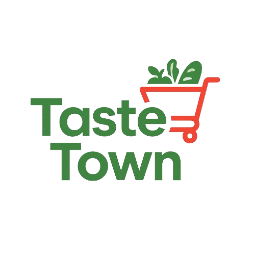
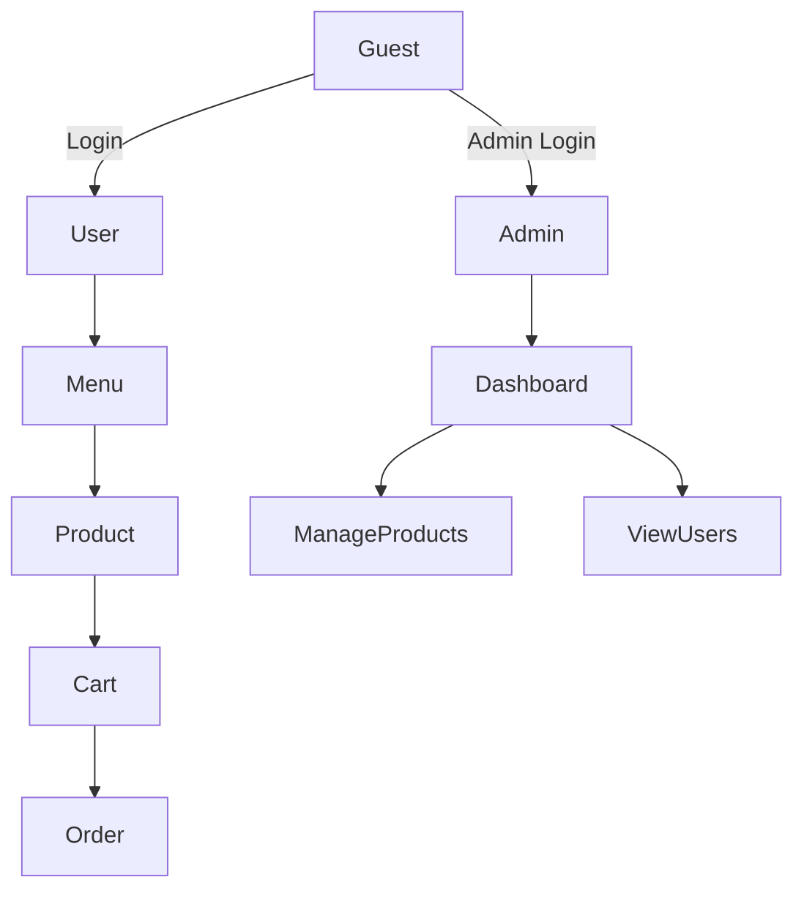
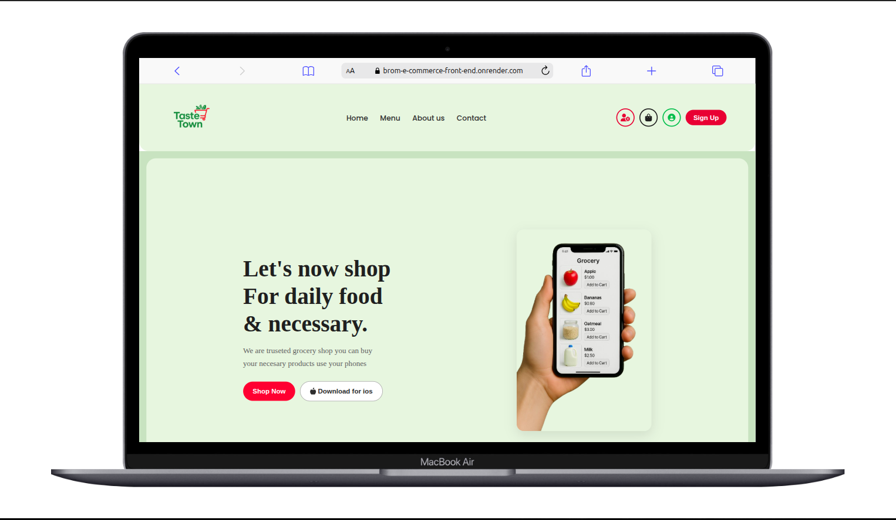
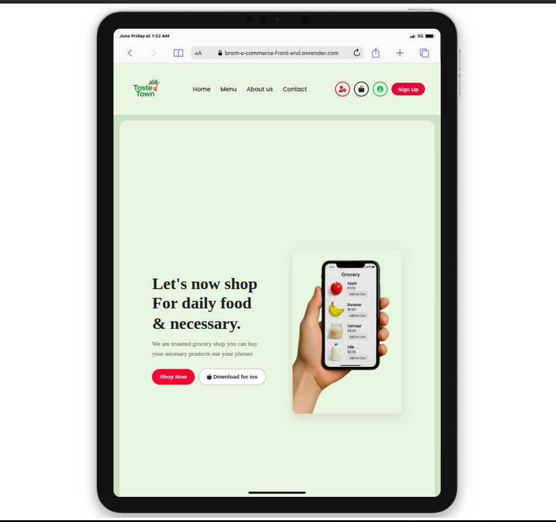
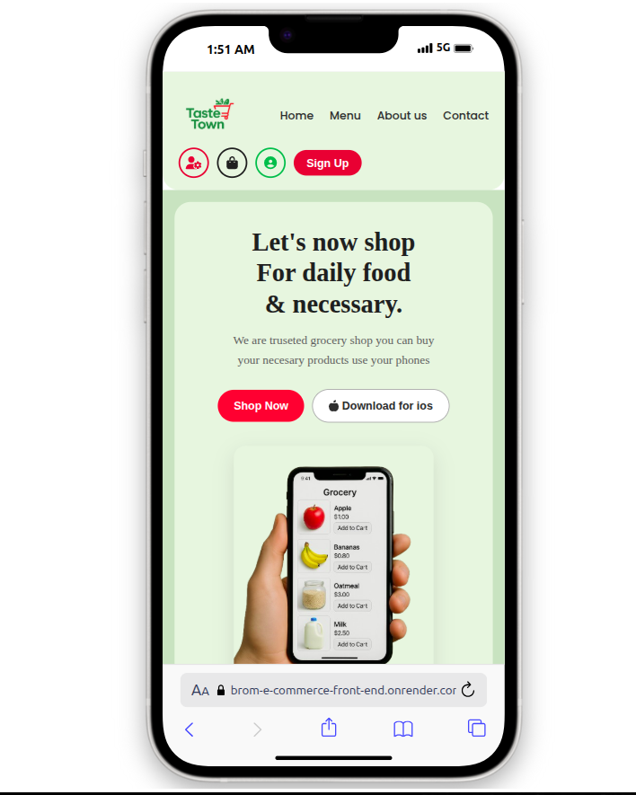

# **Taste Town Frontend**


<p align="center">
  
</p>


>A responsive, dynamic React frontend for Taste Town, a fictional food ordering platform. Built with Vite and React, this UI integrates seamlessly with the Flask backend and supports both user and admin experiences.

---

## **Features**

- User Authentication (Sign up, Login)
- Admin Authentication (Admin Login, View Users)
- Dynamic Navbar (adapts based on auth status)
- Public Pages: Home, About, Contact
- Protected Pages: Menu, Cart, Orders
- Admin Dashboard: Add Food items, Delete Food items, View users
- Shopping cart and checkout Flow
- Orders page with Order History of specific User
- JWT Token storage and Refresh Handling

## **Live Demo & setup**

**Live site:** [Live Link](https://brom-e-commerce-front-end.onrender.com/)

**Repository:** [Taste Town](https://github.com/BROM-town-square)

## **Setup & Installation**

### **Pre-Requisites**

- Node.js (v18 or higher)
- npm (v9 or higher)
- Internet connection (for dependency installation)


## **Installation**

1. Clone this repository:
   ```bash

   git clone https://github.com/BROM-town-square

   ```
2. Navigate to the project directory:
   ```bash

   cd Brom-e-commerce-frontend

   ```
3. Install dependencies:
   ```bash

   npm intsall

   ```

4. Start development server:
   ```bash

   npm run dev

   ```

   Your application should now be running at:
   ```bash

   http://localhost:5173 

   ```

---
## **UI Preview**

### **Home Page**

> Home page can be accessd by pressing `home` on navbar


### **Menu Page**

> Menu can only be acessed when loggged in as **user** or **admin** by selecting `Menu` on navbar


### **Product Detail**

> Product details can be access by pressing on a image in the menu


---

## **User Interface Overview**

>Access via **user circle icon** on the navbar.

### **Navigation Bar**

- Adapts based on user role: Guest, User or Admin
- Mobile-friendly toggle menu on small screens

### **Menu & Product Pages**

- Sidebar filter for category selection
- Product cards with Add to cart button
- Product Detail view includes image, name, price and description

### **Shopping Cart**

- View, update and remove items
- Quantity controls and total calculation
- Place order triggers an order to be made of the current items in cart

### **Order Page**

- Displays logged-in user's past orders

## **Core Components**


### **`App.jsx`- Router & Data Fetcher**

- Uses `React Router` tp define all public/protected routes
-Fetch product data on mount from the backend
- Passes data to child components such as `Menu`, 'ProductDetail` and `Admin`

### **`FilterExchange.jsx` - Filtering & cart logic**

- sidebar for category filter using checkboxes
- Dynamic cart with add/remove/update item features
- Calculate cart total and supports Checkout UX

### **`ProductCard.jsx` - Product Grid**

- Receives data via route state
- Displays additional information like description
- Includes a "Back to Menu" navigation


## **Admin Dashboard Overview**

>Access via **gear icon** in the navbar.

### **`AddProducts.jsx`**

- Controlled form to add new food items
- Includes fields for name, price, category, description, image URL
- Sends POST request to the backend and clears form on success

### **`DeleteProducts.jsx`**

- Table view of all existing products
- Each row has a delete button
- Deletes from backend and only updates UI on success to ensure sync

### **`EditProduct.jsx`**

- Delete table has a edit button that when pressed prompts a pre-filled form with the product detail
- Each row has a edit button
- Edit from backend and only update the UI on sucess to ensure sync

### **`AllUsers.jsx`**

- Table view of all existing users
- Displays username and email
- Prevents display of user password for security 


## **Authentication Details**

- uses **JWT Tokens** stored securely
- Includes **Token Refresh Logic** to keep sessions alive
- Dynamic Navbar changes based on login state
- Separate login UIs for:
   - **Users**: Access to Home, menu, cart, orders
   - **Admins**: Acess to Admin Dashbord

###  **Application Flow Overview**



---


## **Tech Stack**

| Category          | Technology                       |
|-------------------|----------------------------------|
| **Frontend**      | React, Vite, React Router        |
| **Backend**       | Flask (API), Flask-JWT           |
| **Authentication**| JWT (Access + Refresh Tokens)    |
| **Styling**       | CSS (Flexbox, custom styles)     |
| **Build Tool**    | Vite                             |
| **Deployment**    | Render                           |


## **Why These Tools?**

- **React + Vite**: Fast bundling and hot reloading for smooth development.
- **CSS (No framework)**: Gives full control over styles.
- **React Router**: Declarative route management.
- **JWT Auth**: Secure and stateless authentication.

### **Responsive Design**

Taste Town is fully responsive — optimized for mobile, tablet, and Laptop screens.

| Laptop                         | Tablet                        | Mobile                        |
|--------------------------------|-------------------------------|-------------------------------|
|   |  |  |


---

## **Authors**

- [Richard Wasonga](https://github.com/Richard3wasonga)

- [Brian Njuguna](https://github.com/NJUGUNA-png)

- [Joy Mitchel](https://github.com/JoyMitchel)

- [Nevil Oporo](https://github.com/Neviloporo)


## **Contributing**

Pull requests are welcome! For major changes, please open an issue first to discuss your ideas.

---

## **License**

This project is open-source and available under the MIT License.

